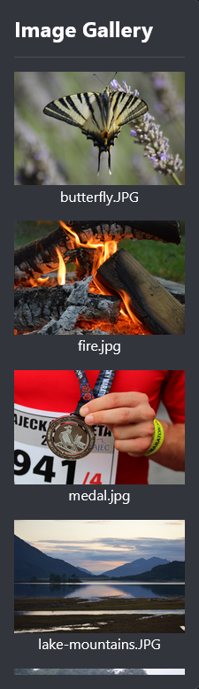

Het startbestand bevat een bibliotheek met nuttige afbeeldingen.

Klik op het icoon "View and Add images":


Scroll door de afbeeldingsbibliotheek en noteer de bestandsnaam van een afbeelding die je wilt gebruiken op jouw webpagina.



Voeg je afbeelding toe aan de `<main></main>` in `index.html` zodat deze op je webpagina verschijnt.

## --- code ---

language: html
filename: index.html
line_numbers: true
line_number_start: 32
line_highlights: 35
--------------------------------------------------------

```
<!-- De belangrijkste inhoud van de webpagina gaat tussen de hoofdtags -->
<main>
  Lorem ipsum dolor sit amet. 
  
   
</main>
```

\--- /code ---
