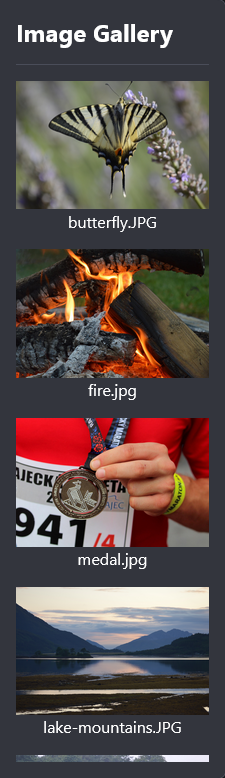

Стартовий файл містить бібліотеку корисних зображень.

Натисни на значок View and Add images («Переглянути та додати зображення»).

Прокрути бібліотеку зображень і занотуй назву зображення, яке ти хочеш використати на своїй сторінці.

Додай це зображення до секції `<main></main>` у файлі `index.html`, щоб воно зʼявилося на твоїй вебсторінці.

--- code ---
---
language: html
filename: index.html
line_numbers: true
line_number_start: 32
line_highlights: 35
---

    <!-- Між тегами main розміщуємо основний вміст сторінки -->
    <main>
      Lorem ipsum dolor sit amet. 
      

    </main>

--- /code ---
